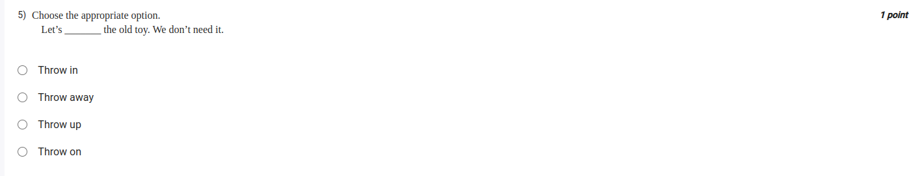

Solution:
Throw in: சேர்த்து விடு, சேர்த்து கொடு
Example: He threw in a few extra candies.
அவர் சில கூடுதல் இனிப்பு கொடுத்தார்.
extra add pandrathu

Throw away: தள்ளி விடு, குப்பையில் போடு
Example: Let’s throw away the old toy.
பழைய பொம்மையை தள்ளி விடுவோம்.

Throw up: வாந்தி எடு
Example: She feels like throwing up.
அவள் வாந்தி எடுக்க நினைக்கிறாள்.

Throw on: விரைவாக அணிந்து கொள்
Example: I’ll throw on a jacket before leaving.
நான் கிளம்புவதற்கு முன் ஜாக்கெட் விரைவாக அணிந்து கொள்கிறேன்.

- So the answer is throw away

